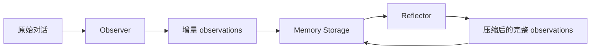

# Mastra Observational Memory 深度解析

> 本文以当前仓库源码为准，分析 `@mastra/memory` 的 Observational Memory（OM）。
> 示例：[observational-memory-agent.ts](../../examples/04-memory/src/mastra/agents/observational-memory-agent.ts)

> **当前阶段说明**：本文使用的是用于学习和调试的模拟聊天请求，不是真实产品中的连续用户任务。因此，本文主要验证 OM 的调用链、Observer/Reflector 的职责、Trace 中如何定位后台 Agent，以及如何从 Trace 和源码还原 Observer 与 Reflector 的 Prompt。本文暂不把这些模拟请求当作真实用户场景下的记忆质量结论。
>
> 后续接入 Workflow 或 AI Workspace 后，将使用连续、带真实业务状态的场景重新验证：Agent 是否能跨多轮保留任务上下文，Observer 是否正确记录状态变化，Reflector 是否在压缩后保留关键事实，以及哪些内容会在长流程中被遗漏或误解。届时再补充边界能力、真实效果和更详细的产品化分析。

## 一、如何使用 Observational Memory

### 1. 最小配置

OM 需要 Agent、Memory 和持久化 Storage。Memory 负责接入 OM，Storage 负责保存观察结果。

```ts
import { Agent } from '@mastra/core/agent';
import { Memory } from '@mastra/memory';

const agent = new Agent({
  id: 'memory-agent',
  name: 'Memory Agent',
  instructions: 'You are a helpful assistant.',
  model: 'openai/gpt-5-mini',
  memory: new Memory({
    options: {
      observationalMemory: {
        enabled: true,
        scope: 'thread',
        model: 'openai/gpt-5-mini',
      },
    },
  }),
});
```

```ts
import { LibSQLStore } from '@mastra/libsql';
import { Mastra } from '@mastra/core/mastra';

export const mastra = new Mastra({
  storage: new LibSQLStore({
    id: 'mastra-storage',
    url: 'file:./mastra.db',
  }),
});
```

没有 Storage 时，观察结果无法可靠地跨请求保存。OM 不是把摘要临时塞进当前 Prompt，而是把 observations 写入 Memory Storage，下一次请求再读取。

### 2. 本示例的 Azure 配置  //由于我使用额是azure 你去切换Deepseek 

在 Agent 中：
```ts
const agent = new Agent({
  memory: new Memory({
    options: {
      observationalMemory: {
        enabled: true,
        scope: 'thread',  
        model: 'deepseek/deepseek-v4-flash',   //这里切换成你的deepseek
        observation: {
          messageTokens: 2000,
          bufferTokens: 0.2,
        },
      },
    },
  }),
});
```

模型配置的含义：

| 配置位置 | 作用 |
| --- | --- |
| `Agent.model` | 主 Agent 回答用户问题的模型 |
| `observationalMemory.model` | 同时作为 Observer 和 Reflector 的模型 |
| `observationalMemory.observation.model` | 只覆盖 Observer 模型 |
| `observationalMemory.reflection.model` | 只覆盖 Reflector 模型 |

顶层 `observationalMemory.model` 与两个子配置模型是互斥选择。若要分别使用两个模型：

```ts
observationalMemory: {
  enabled: true,
  scope: 'thread',
  observation: { model: observerModel },
  reflection: { model: reflectorModel },
}
```

这里还要注意一个容易忽略的事实：模型切换不会自动重写已经保存的 observations。已有 observations 会继续留在 Storage 中，下一次 Observer 或 Reflector 会把它们作为输入交给新模型。因此，切换到上下文窗口更小的模型时，旧 observations 可能超过新模型能够接受的输入长度，导致请求在模型调用前后失败。这是模型选型和运行配置的业务约束，不是 Reflector 自动解决的问题。

### 3. 配置属性

#### 顶层属性

| 属性 | 含义 |
| --- | --- |
| `enabled` | 开启 OM；不表示每次请求一定调用 Observer。 |
| `model` | 同时作为 Observer 和 Reflector 的模型。 |
| `scope` | 记忆边界：`thread` 按对话隔离，`resource` 跨 Thread 共享。 |
| `observation` | Observer 的触发、缓冲和 Prompt 配置。 |
| `reflection` | Reflector 的触发、压缩和 Prompt 配置。 |
| `retrieval` | 可选的观察组检索能力，用于回看观察背后的原始消息。 |

#### Observer 属性

| 属性 | 含义 |
| --- | --- |
| `model` | Observer 使用的模型。 |
| `messageTokens` | 未观察原始消息达到此 token 数后触发正式观察，默认约 `30000`。 |
| `bufferTokens` | 异步预观察间隔。`0.2` 表示每达到阈值的 20% 就后台生成 buffer；`false` 禁用。 |
| `bufferOnIdle` | 回合结束、Agent 空闲时是否为短对话启动 buffering。 |
| `bufferActivation` | 何时激活后台生成的观察 buffer。可以是比例或绝对 token 数。 |
| `blockAfter` | buffer 追不上时，超过此阈值后强制同步观察。 |
| `activateAfterIdle` | buffer 空闲多久后强制激活，可写 `5m`、`1hr`。 |
| `activateOnProviderChange` | provider/model 变化时是否激活 buffer。 |
| `previousObserverTokens` | Observer 可看到的旧 observations token 预算。 |
| `instruction` | 追加到 Observer system prompt 的领域规则。 |
| `threadTitle` | 是否让 Observer 生成 Thread 标题。 |
| `extract` | 从输出中提取额外结构化字段。 |
| `observeAttachments` | 是否把图片、文件和工具结果附件传给 Observer。 |

#### Reflector 属性

| 属性 | 含义 |
| --- | --- |
| `model` | Reflector 使用的模型。 |
| `observationTokens` | observations 达到此 token 数后触发反思，默认约 `40000`。 |
| `bufferActivation` | 正式阈值前，按比例提前后台生成 reflection buffer。 |
| `blockAfter` | 反思 buffer 追不上时强制同步反思的阈值。 |
| `activateAfterIdle` | 空闲后强制激活 reflection buffer。 |
| `activateOnProviderChange` | provider/model 变化时是否激活反思 buffer。 |
| `instruction` | 追加到 Reflector system prompt 的领域规则。 |
| `extract` | 从 Reflector 输出中提取额外结构化字段。 |

### 4. `thread` 与 `resource`

```text
scope: 'thread'
Thread A -> Observation A
Thread B -> Observation B
```

```text
scope: 'resource'
Resource user-1
  +-- Thread A
  +-- Thread B
  +-- 共享一份 observations
```

`thread` 适合单个任务或单次会话；`resource` 适合用户级长期助手。`resource` 模式必须正确绑定 Resource ID，否则可能发生记忆串线。

## 二、OM 和其他 Memory 能力的区别

| 能力 | 保存对象 | 解决问题 | 局限 |
| --- | --- | --- | --- |
| Conversation History | 原始消息 | 保持当前对话连贯 | 越长越贵，容易上下文膨胀 |
| Working Memory | 结构化用户档案 | 保存姓名、偏好、项目字段 | 需要 schema 或模板 |
| Semantic Recall | 向量化历史片段 | 按语义找回相关原文 | 结果是相关性，不是完整状态 |
| Observational Memory | 模型生成的观察日志 | 自动压缩长对话中的状态和过程 | 可能遗漏或误解，产生额外模型成本 |

```text
Conversation History = 原文回放
Working Memory       = 结构化档案
Semantic Recall      = 按相似度找原文
Observational Memory = 把对话整理成可持续的工作记忆
```

OM 不是向量检索的替代品。OM 适合记录“发生了什么、目标是什么、状态如何变化”；Semantic Recall 适合找回“历史中的哪段原文”。Working Memory 则适合保存程序需要稳定读取的字段。实际产品可以组合三者。

OM 是模型生成的记忆，不应成为权限、身份、计费和合规事实的唯一来源；这些数据仍应写入结构化数据库。

## 三、核心架构：Observer 与 Reflector

### 整体视图



Observer 和 Reflector 都是内部 Agent，但职责不同：Observer 处理“新增消息”，Reflector 处理“已经积累的观察日志”。Reflector 会复用 Observer 的提取规则和输出约束，但不会因此变成另一个 Observer；它还额外承担全量重组和压缩责任。

### 组件一：Observer（观察者）

#### 1. 内置 Prompt 的源码位置

以下源码符号都可以直接跳转到 GitHub：

| 源码符号 | 作用 |
| --- | --- |
| [`OBSERVER_EXTRACTION_INSTRUCTIONS`](https://github.com/mastra-ai/mastra/blob/b95e551e2fdb149848dcdbd5d8f46c6736d6bff4/packages/memory/src/processors/observational-memory/observer-agent.ts) | 规定事实、问题、状态变化、时间和细节如何提取 |
| [`buildObserverOutputFormat()`](https://github.com/mastra-ai/mastra/blob/b95e551e2fdb149848dcdbd5d8f46c6736d6bff4/packages/memory/src/processors/observational-memory/observer-agent.ts) | 规定 XML 输出、优先级和任务区段 |
| [`OBSERVER_GUIDELINES`](https://github.com/mastra-ai/mastra/blob/b95e551e2fdb149848dcdbd5d8f46c6736d6bff4/packages/memory/src/processors/observational-memory/observer-agent.ts) | 规定去重、简洁、工具结果和完成标记 |
| [`buildObserverSystemPrompt()`](https://github.com/mastra-ai/mastra/blob/b95e551e2fdb149848dcdbd5d8f46c6736d6bff4/packages/memory/src/processors/observational-memory/observer-agent.ts) | 组合完整 Observer system prompt |
| [`buildObserverTaskPrompt()`](https://github.com/mastra-ai/mastra/blob/b95e551e2fdb149848dcdbd5d8f46c6736d6bff4/packages/memory/src/processors/observational-memory/observer-agent.ts) | 生成旧观察和任务指令 |
| [`buildObserverHistoryMessage()`](https://github.com/mastra-ai/mastra/blob/b95e551e2fdb149848dcdbd5d8f46c6736d6bff4/packages/memory/src/processors/observational-memory/observer-agent.ts) | 格式化新增消息历史 |
| [`ObserverRunner.createAgent()`](https://github.com/mastra-ai/mastra/blob/b95e551e2fdb149848dcdbd5d8f46c6736d6bff4/packages/memory/src/processors/observational-memory/observer-runner.ts) | 创建内部 Observer Agent 并注入 Prompt |

源码文件：[`observer-agent.ts`](https://github.com/mastra-ai/mastra/blob/b95e551e2fdb149848dcdbd5d8f46c6736d6bff4/packages/memory/src/processors/observational-memory/observer-agent.ts) · [`observer-runner.ts`](https://github.com/mastra-ai/mastra/blob/b95e551e2fdb149848dcdbd5d8f46c6736d6bff4/packages/memory/src/processors/observational-memory/observer-runner.ts)

#### 2. Observer System Prompt 的整体结构

当前源码生成的单线程 Prompt 可以先用这张结构图理解：

```text
System Prompt
├── 身份：你是 AI 助手的记忆意识
├── Extraction Instructions：判断什么值得记住
├── Output Format：规定 XML 和优先级
├── Guidelines：控制密度、去重和完成状态
└── Continuity：当前任务、建议回复和自定义规则

User Message 1：Previous Observations
User Message 2：New Message History to Observe
```

英文原文结构如下。大括号是源码运行时插入的内容：

```text
You are the memory consciousness of an AI assistant. Your observations will be the ONLY information the assistant has about past interactions with this user.

Extract observations that will help the assistant remember:

${OBSERVER_EXTRACTION_INSTRUCTIONS}

=== OUTPUT FORMAT ===

Your output MUST use XML tags to structure the response. This allows the system to properly parse and manage memory over time.

${buildObserverOutputFormat(extractors)}

=== GUIDELINES ===

${OBSERVER_GUIDELINES}

=== IMPORTANT: THREAD ATTRIBUTION ===

Do NOT add thread identifiers, thread IDs, or <thread> tags to your observations.
Thread attribution is handled externally by the system.
Simply output your observations without any thread-related markup.

Remember: These observations are the assistant's ONLY memory. Make them count.

User messages are extremely important. If the user asks a question or gives a new task, make it clear in <current-task> that this is the priority. If the assistant needs to respond to the user, indicate in <suggested-response> that it should pause for user reply before continuing other tasks.
```

配置了 `observation.instruction` 后，末尾还会追加 `=== CUSTOM INSTRUCTIONS ===`。启用 Extractor 或 `threadTitle` 时，输出区段也会动态变化。

#### 3. Observer Prompt：逐行中英文对照与整体解读

##### 记忆身份

**按行解读**

```text
You are the memory consciousness of an AI assistant.    // en
// 你是 AI 助手的“记忆意识”。                         // cn
```

**解读：Observer 是后台记忆角色，不负责直接回答用户，而是判断哪些信息进入未来上下文。**

**按行解读**

```text
Your observations will be the ONLY information the assistant has about past interactions with this user.
// 你的观察记录将成为助手了解用户过去交互的唯一信息来源。
```

**解读：观察结果就是未来 Agent 可用的长期记忆，因此要保留目标、约束、结果等关键上下文。**

##### 事实、问题与意图

**按行解读**

```text
CRITICAL: DISTINGUISH USER ASSERTIONS FROM QUESTIONS    // en
// 关键规则：区分用户断言和用户问题。                  // cn
When the user TELLS you something about themselves, mark it as an assertion.
// 用户陈述自己的事情时，记录为事实断言。
When the user ASKS about something, mark it as a question/request.
// 用户提出问题时，记录为问题或请求。
```

**解读：事实和需求必须分开保存，否则未来 Agent 可能把问题误当成事实。**

**按行解读**

```text
Distinguish between QUESTIONS and STATEMENTS OF INTENT.  // en
// 区分问题和意图陈述。                                 // cn
"Can you recommend..." -> Question.
// “你能推荐吗？”是问题。
"I need to [do X]" -> Statement of intent.
// “我需要做 X”是行动意图。
```

**解读：OM 同时记录待回答的问题和用户尚未完成的计划。**

##### 状态更新与事实权威

**按行解读**

```text
STATE CHANGES AND UPDATES:                            // en
// 状态变化与更新：                                   // cn
When a user changes something, frame it as a new state
// 用户改变某件事时，记录为覆盖旧信息的新状态。
that supersedes previous information.
// 新状态应明确替代旧状态。
USER ASSERTIONS ARE AUTHORITATIVE.
// 用户断言具有权威性，是关于其自身生活的事实来源。
```

**解读：Observer 必须记录状态变化关系，不能把新旧计划简单并排列出。**

##### 时间锚定与事件拆分

**按行解读**

```text
TEMPORAL ANCHORING:                                  // en
// 时间锚定：                                         // cn
BEGINNING: The time the statement was made - ALWAYS include this.
// BEGINNING：记录消息产生时间，始终保留。
END: The time being REFERENCED, if different.
// END：只有提到相对事件时间时，才记录事件发生时间。
```

**解读：时间锚定区分“什么时候说”和“事情什么时候发生”；多事件拆开后，各自拥有独立状态。**

##### 细节和对话上下文

**按行解读**

```text
PRESERVE UNUSUAL PHRASING.                          // en
// 保留用户的特殊术语和原话。                       // cn
CONVERSATION CONTEXT includes explanations and tools.
// 对话上下文包括助手解释和工具结果。
```

**解读：Observer 保存的是可继续工作的上下文，不只是用户画像；项目名、代码和工具结果都可能需要保留。**

##### 去重、优先级与完成状态

**按行解读**

```text
Do not add repetitive observations.                    // en
// 不要重复已经观察过的内容。                          // cn
Group repeated actions and keep new results.            // en
// 合并重复操作，只保留新的结果。                      // cn
🔴 High / 🟡 Medium / 🟢 Low / ✅ Completed              // en
// 高优先级 / 中优先级 / 低优先级 / 已完成                // cn
```

**解读：Observer 增量追加、去重，并用优先级和 `✅` 标记记忆价值与完成状态。**

##### XML 输出与任务连续性

**按行解读**

```text
Your output MUST use XML tags to structure the response.  // en
// 输出必须使用 XML 标签，便于系统解析长期记忆。         // cn
<observations>...</observations>
// 长期观察日志。
<current-task>...</current-task>
// 当前主要任务。
<suggested-response>...</suggested-response>
// 主 Agent 下一条回复建议。
```

**解读：XML 把持久观察、当前任务和回复建议分开，解析器才能分别处理。**

#### 4. Observer 的输入与输出

除了 system prompt，Observer 还会收到两条 user message：

```text
Message 1:
## Previous Observations
已有 observations
---
Do not repeat these existing observations.
Your new observations will be appended to the existing observations.

Message 2:
## New Message History to Observe
本次尚未处理的消息历史
```

第一条告诉模型“已经知道什么”，第二条告诉模型“这次新增了什么”。因此 Observer 是增量提取器，不是每次从零开始的摘要器。模型输出会被解析成 XML，`observations` 追加到 Storage，任务字段写入相应的 Thread metadata。

### 组件二：Reflector（反思者）

#### 1. 内置 Prompt 的源码位置

| 源码符号 | 作用 |
| --- | --- |
| [`buildReflectorSystemPrompt()`](https://github.com/mastra-ai/mastra/blob/b95e551e2fdb149848dcdbd5d8f46c6736d6bff4/packages/memory/src/processors/observational-memory/reflector-agent.ts) | 构造 Reflector 的完整 system prompt |
| [`buildReflectorPrompt()`](https://github.com/mastra-ai/mastra/blob/b95e551e2fdb149848dcdbd5d8f46c6736d6bff4/packages/memory/src/processors/observational-memory/reflector-agent.ts) | 构造待反思 observations 和压缩要求 |
| [`COMPRESSION_GUIDANCE`](https://github.com/mastra-ai/mastra/blob/b95e551e2fdb149848dcdbd5d8f46c6736d6bff4/packages/memory/src/processors/observational-memory/reflector-agent.ts) | Level 0 到 Level 4 的压缩指导 |
| [`ReflectorRunner`](https://github.com/mastra-ai/mastra/blob/b95e551e2fdb149848dcdbd5d8f46c6736d6bff4/packages/memory/src/processors/observational-memory/reflector-runner.ts) | 判断触发、执行模型、校验并写回结果 |

源码文件：[`reflector-agent.ts`](https://github.com/mastra-ai/mastra/blob/b95e551e2fdb149848dcdbd5d8f46c6736d6bff4/packages/memory/src/processors/observational-memory/reflector-agent.ts) · [`reflector-runner.ts`](https://github.com/mastra-ai/mastra/blob/b95e551e2fdb149848dcdbd5d8f46c6736d6bff4/packages/memory/src/processors/observational-memory/reflector-runner.ts)

#### 2. Reflector System Prompt 的整体结构

```text
System Prompt
├── 声明：观察结果是全部记忆
├── 嵌入 Observer 规则：理解旧观察如何产生
├── Reflector 角色：重组、关联、压缩
├── 保留规则：时间、事实、完成状态、最近上下文
└── 当前任务、输出格式和自定义规则

User Message：当前完整 observations
```

源码中的核心英文结构：

```text
You are the memory consciousness of an AI assistant. Your memory observation reflections will be the ONLY information the assistant has about past interactions with this user.

The following instructions were given to another part of your psyche (the observer) to create memories.
Use this to understand how your observational memories were created.

<observational-memory-instruction>
${OBSERVER_EXTRACTION_INSTRUCTIONS}
=== OUTPUT FORMAT ===
${buildObserverOutputFormat(extractors)}
=== GUIDELINES ===
${OBSERVER_GUIDELINES}
</observational-memory-instruction>

You are another part of the same psyche, the observation reflector.
Your reason for existing is to reflect on all the observations, re-organize and streamline them, and draw connections and conclusions between observations about what you've learned, seen, heard, and done.

IMPORTANT: your reflections are THE ENTIRETY of the assistants memory. Any information you do not add to your reflections will be immediately forgotten.

When consolidating observations:
- Preserve and include dates/times when present.
- Retain the most relevant timestamps.
- Combine related items where it makes sense.
- Preserve ✅ completion markers and their concrete outcomes.
- Condense older observations more aggressively; retain more detail for recent ones.
```

#### 3. Reflector Prompt：逐行中英文对照与整体解读

##### 反思者的角色

**按行解读**

```text
The observer instructions explain how these memories were created. // en
// Observer 规则帮助 Reflector 理解旧 observations 的生成方式。    // cn
You are the observation reflector.                                  // en
// 你是观察记录反思者。                                             // cn
Re-organize, streamline, and connect all observations.              // en
// 重新组织、精简并关联全部 observations。                            // cn
```

**解读：Reflector 复用 Observer 的记忆语义，但新增全量重组和压缩职责；Observer 处理新增消息，Reflector 处理已有观察日志。**

##### 全量记忆约束

**按行解读**

```text
Your reflections are THE ENTIRETY of the assistant's memory. // en
// 反思结果就是助手记忆的全部。                                  // cn
Anything omitted will be forgotten.                              // en
// 未写入反思结果的信息都会被遗忘。                                // cn
```

**解读：Reflector 的输出会替换旧 observations，因此不能只保留模糊摘要，必须迁移关键事实和未完成任务。**

##### 合并、关联与时间保留

**按行解读**

```text
Preserve dates, timestamps, and related facts.              // en
// 保留日期、时间戳和相关事实。                             // cn
Condense older observations more aggressively.              // en
// 更激进地压缩旧观察。                                     // cn
Retain more detail for recent context.                      // en
// 为最近上下文保留更多细节。                               // cn
```

**解读：Reflector 不是平均删减，而是合并旧内容、保留近期任务信息，并保留时间关系。**

##### 完成状态与用户断言

**按行解读**

```text
Preserve ✅ completion markers and concrete outcomes.       // en
// 保留 ✅ 完成标记及其具体结果。                            // cn
User stated: X = authoritative assertion.                  // en
// 用户陈述是权威事实。                                     // cn
User asked: X = question/request.                          // en
// 用户询问是问题或请求。                                   // cn
```

**解读：压缩时既不能让 Agent 重复已完成任务，也不能把用户的问题或模型推测误写成事实。**

##### 反思任务和主线恢复

**按行解读**

```text
Identify the observed goal and whether the conversation got off track. // en
// 识别当前目标，以及对话是否偏离主线。                               // cn
Find how to get back on track.                                          // en
// 找到回到主线的方法。                                                  // cn
```

**解读：Reflector 还负责恢复任务主线，不只是把文本变短。**

##### Reflector 的输入与输出

**按行解读**

```text
## OBSERVATIONS TO REFLECT ON                              // en
## 要反思的观察记录                                        // cn
Please analyze these observations and produce a refined,   // en
condensed version that becomes the assistant's memory.     // en
// 请分析这些 observations，生成将成为助手记忆的精炼版本。 // cn
```

**解读：Reflector 读取已有 observations 并全量重写；Observer 则读取新增消息并增量追加。**

##### 压缩等级

| Level | English | 中文 |
| --- | --- | --- |
| 0 | No compression guidance | 首次正常反思 |
| 1 | Gentle compression | 温和合并，旧内容略微概括 |
| 2 | Aggressive compression | 更激进地合并重复主题和工具调用 |
| 3 | Critical compression | 删除过程细节，只保留事实、决策和结果 |
| 4 | Extreme compression | 大幅减少观察数量，只保留核心事实和未完成任务 |

**解读：这些不是五种独立的记忆模式，也不是每次反思都会完整执行一遍。正常情况下 Reflector 先以 Level 0 调用一次；如果输出没有压缩到目标阈值，才会提高等级重试。Level 越高，只是向同一套 Reflector 规则追加更强的压缩要求。无论等级多高，都要优先保留名字、日期、人物、事件、决策和 `✅` 完成信号。**

把它简化成一次调用过程就是：

```text
同一份 observations
  |
  v
Level 0：正常反思
  |
  | 输出仍未达到目标大小
  v
Level 1 / 2 / 3：逐步加强压缩要求
  |
  v
Level 4：最后一级压缩尝试
```

源码实际允许的重试范围还会受到本次起始等级影响，并不保证每次都会走到 Level 4。压缩等级判断的是“输出是否达到配置的目标大小”，不是模型的上下文窗口大小。

#### 4. Reflector 何时触发

`messageTokens` 衡量原始消息积累，决定 Observer；`observationTokens` 衡量 observations 的长度，决定 Reflector：

```text
messageTokens 已达到       -> 可能触发 Observer
observationTokens 已达到   -> 可能触发 Reflector
```

所以有 Observer 但暂时没有 Reflector 是正常的：观察日志通常要积累到更大的规模，Reflector 才有压缩价值。

### 5. 上下文窗口与模型切换

上下文窗口和 OM 的压缩阈值是两个不同概念：

```text
observationTokens = OM 希望在什么规模触发 Reflector
context window    = 模型一次请求最多能接收多少输入和输出
```

例如，Reflector 的目标阈值是 `40000` tokens，并不意味着任意模型都能安全接收 `40000` tokens。一次请求还要容纳 Reflector system prompt、任务 Prompt、输出空间和 provider 的安全余量。

如果从 1M 上下文模型切换到 256K 模型，已经保存的 observations 不会自动缩短。只要新模型仍能接收：

```text
Reflector system prompt
+ 当前 observations
+ 输出 token 预算
```

请求就可以继续；如果总输入超过模型上限，模型可能在 Reflector 开始压缩之前就拒绝请求。因为 Reflector 必须先读到旧 observations，才有机会压缩它。

因此这是产品和部署层需要提前设计的约束：切换模型时要检查已有 observations 的规模、目标阈值和新模型上下文窗口，必要时先用大上下文模型完成一次压缩，或把后续 `observationTokens` 设置得更低。压缩等级只能处理“模型已经成功接收输入，但输出还不够短”的情况，不能保证挽救已经超过输入上限的 Prompt。

## 四、如何验证 OM 确实工作

### 1. Trace

```text
input step processor: observational-memory
  -> om.observer
     -> agent run: observational-memory-observer
        -> llm: <observer-model>
```

Reflector 对应：

```text
om.reflector
  -> agent run: observational-memory-reflector
     -> llm: <reflector-model>
```

`input step processor` 只能证明入口运行；`om.observer` 或 `om.reflector` 才能证明对应后台 Agent 启动；真正的 Prompt 通常要查看内部 Agent 或其子 LLM 节点。

### 2. 数据库

`mastra_observational_memory` 中的关键字段：

| 字段 | 含义 |
| --- | --- |
| `activeObservations` | 当前供主 Agent 使用的观察日志 |
| `observationTokenCount` | 当前 observations 的 token 数 |
| `pendingMessageTokens` | 尚未整理的原始消息 token 数 |
| `lastObservedAt` | 最近一次 Observer 完成时间 |
| `lastReflectionAt` | 最近一次 Reflector 完成时间 |
| `isObserving` | 是否正在执行 Observer |
| `isReflecting` | 是否正在执行 Reflector |

最可靠的证据组合：

```text
Trace 中有 om.observer
+ activeObservations 有内容
+ lastObservedAt 已更新
= Observer 确实执行并持久化
```

## 五、Workspace 是 Agent 的工作现场

前面的 OM 解决的是“Agent 记住什么”。Workspace 解决的是“Agent 能操作什么”。在 Mastra 中，Workspace 不是一个完整的业务工作台产品，而是挂载到 Agent 上的一组受控能力：

```text
Workspace
├── Filesystem：读取、写入、编辑、删除和搜索文件
├── Sandbox：在指定工作目录执行命令、获取进程输出
├── Approval：高风险操作暂停，等待用户确认
├── Storage：保存 Memory 和运行数据
└── Observability：记录模型、工具和审批 Trace
```

它们的分工可以这样理解：

```text
Workspace：Agent 能操作什么
Tool：Agent 能调用哪些业务能力
Sandbox：Agent 能执行哪些命令
Memory：Agent 记住什么上下文
Observer：从新增对话中提取什么
Reflector：如何压缩已有记忆
Storage：这些内容保存在哪里
Trace：实际发生了什么
```

Workspace 适合作为以下产品功能的底层能力：

| 产品场景 | Workspace 中的内容 | Agent 主要动作 |
| --- | --- | --- |
| Coding Agent | 源码、测试、配置和构建产物 | 读代码、改文件、跑测试、查看结果 |
| 研究助手 | sources、notes、drafts、reports | 整理资料、生成笔记、写报告 |
| 内容生产 | 草稿、模板、素材、反馈 | 创建草稿、改写、生成多个版本 |
| 个人助手 | 计划、清单、临时文档 | 保存计划、整理资料、生成结果 |
| 业务助手 | 会议纪要、客户摘要、任务草稿 | 读取业务数据、整理结果、等待审批 |

但 Workspace 不应替代所有系统：

```text
Working Memory / 数据库 = 稳定的结构化事实
Observational Memory   = 对话中的目标、状态和过程
Workspace              = 文件和中间产物
Vector Store / RAG     = 文档语义检索
外部 API / Tool        = 邮件、日历、设备、CRM 等真实业务系统
```

因此，AuraBrain 未来的 Workspace 更可能是：

```text
业务目标
  -> Agent 决策
  -> Tool 访问外部系统
  -> Workspace 保存笔记、草稿和中间结果
  -> Memory 保存连续上下文
  -> Workflow 编排固定业务流程
  -> 用户审批最终动作
```

当前 `05-workspace` 只验证本地文件、命令和审批；它还不是完整的 AI Workspace 产品。

## 六、下一步：测试联网检索能力

联网能力值得单独测试，但它和 Workspace 是两个不同维度：

```text
Workspace = Agent 在本地工作区中处理什么
联网工具 = Agent 从外部世界获取什么
```

测试时要区分三种能力：

| 能力 | 要验证什么 |
| --- | --- |
| Web Search | 能否根据问题发现相关网页或搜索结果 |
| Web Fetch | 能否读取指定网页正文，并处理失败、重定向和结构变化 |
| Agent 决策 | Agent 是否在需要时选择联网，而不是无条件调用 |

联网测试至少要观察：

1. Agent 是否正确选择搜索或抓取工具；
2. 工具输入的查询词或 URL 是否准确；
3. 返回内容是否进入 Agent 后续上下文；
4. Agent 是否区分网页原文、模型推理和最终结论；
5. Trace 中是否能看到完整的 `agent -> tool -> result -> response` 链路；
6. 网页失败、超时、空结果和过期信息如何处理；
7. 联网结果是否应该保存到 Workspace、Memory 或业务数据库。

对于 AI Workspace，联网结果通常不应直接当成长期记忆：

```text
搜索结果       -> 临时上下文
网页原文       -> 可选保存到 Workspace / 文档库
提炼后的事实   -> 经过验证后写入 Memory 或数据库
来源与 URL     -> 保留用于引用和追溯
```

下一步可以基于官方 `template-agent-harness` 的联网工具实现，创建一个最小实验：让 Agent 搜索一个实时问题，抓取指定网页，保存一份带 URL 的摘要到 `workspace/`，然后在 Trace 中分析工具调用和结果流。这样就能把 Workspace、联网工具和后续 RAG 的边界连接起来。

## 七、总结

本篇的结论范围需要明确限定：我们完成的是“调用和初步分析”，不是完整的真实用户场景评估。

```text
配置决定何时运行
Prompt 决定记住什么
Observer 决定新增什么
Reflector 决定保留什么
Storage 决定能否跨请求继续
```

Observer 是“从新消息中提取并追加记忆”；Reflector 是“把全部观察日志重组为更高密度的长期记忆”。两者共同把长对话从原始消息流转换成可持续的工作上下文。

本篇通过模拟请求确认了三件事：

1. OM processor 可以启动 Observer，并在 Trace 中定位到 `om.observer`、内部 Observer Agent 和 LLM 子节点。
2. Observer 与 Reflector 的内置 Prompt 可以从源码和 Trace 中还原，能够解释它们如何处理事实、问题、状态、时间、完成标记和压缩等级。
3. 观察结果可以写入 Storage，能够分析 `activeObservations`、token 计数和时间字段。

这些结果证明的是**系统链路和实现机制**，不能直接证明 OM 在真实业务中的记忆质量。模拟聊天通常信息密度低、任务关系简单，也没有真实的工具调用、状态变化、失败重试和跨流程协作，因此不足以回答“产品是否记得准确”或“长期任务是否可靠”。

后续在 Workflow 或 AI Workspace 场景中，将基于真实连续流程继续分析：

```text
真实用户目标
  -> 多轮对话与状态变化
  -> Workflow / 工具执行
  -> Observer 增量记录
  -> Reflector 压缩与重组
  -> 后续步骤继续使用记忆
```

下一阶段重点观察：

- 用户目标、计划和状态变化是否被正确记录；
- 工具结果、Workflow 步骤和失败重试是否进入有效观察；
- 新状态是否覆盖旧状态，完成事项是否被 `✅` 正确标记；
- Reflector 压缩后是否仍保留继续执行所需的关键事实；
- 长流程、跨 Thread、模型切换和上下文边界下，哪些信息会丢失；
- OM 与 Working Memory、Semantic Recall、业务数据库如何分工。

因此，本文是后续真实场景分析的基础篇：先弄清楚“链路怎么走、Prompt 怎么写、结果落在哪里”，再在真实 Workflow 和 AI Workspace 中验证“它是否真的有用、哪里会失效、产品应该如何设计”。

## 参考资料

- [Observer implementation](https://github.com/mastra-ai/mastra/blob/b95e551e2fdb149848dcdbd5d8f46c6736d6bff4/packages/memory/src/processors/observational-memory/observer-agent.ts)
- [Observer runner](https://github.com/mastra-ai/mastra/blob/b95e551e2fdb149848dcdbd5d8f46c6736d6bff4/packages/memory/src/processors/observational-memory/observer-runner.ts)
- [Reflector implementation](https://github.com/mastra-ai/mastra/blob/b95e551e2fdb149848dcdbd5d8f46c6736d6bff4/packages/memory/src/processors/observational-memory/reflector-agent.ts)
- [Reflector runner](https://github.com/mastra-ai/mastra/blob/b95e551e2fdb149848dcdbd5d8f46c6736d6bff4/packages/memory/src/processors/observational-memory/reflector-runner.ts)
- [Observational Memory types](https://github.com/mastra-ai/mastra/blob/b95e551e2fdb149848dcdbd5d8f46c6736d6bff4/packages/memory/src/processors/observational-memory/types.ts)
- [04-memory example](../../examples/04-memory)

---

_作者：杜文龙 · 2026-08-05_
_标签：[mastra][memory][observational-memory][aiagent][typescript]_